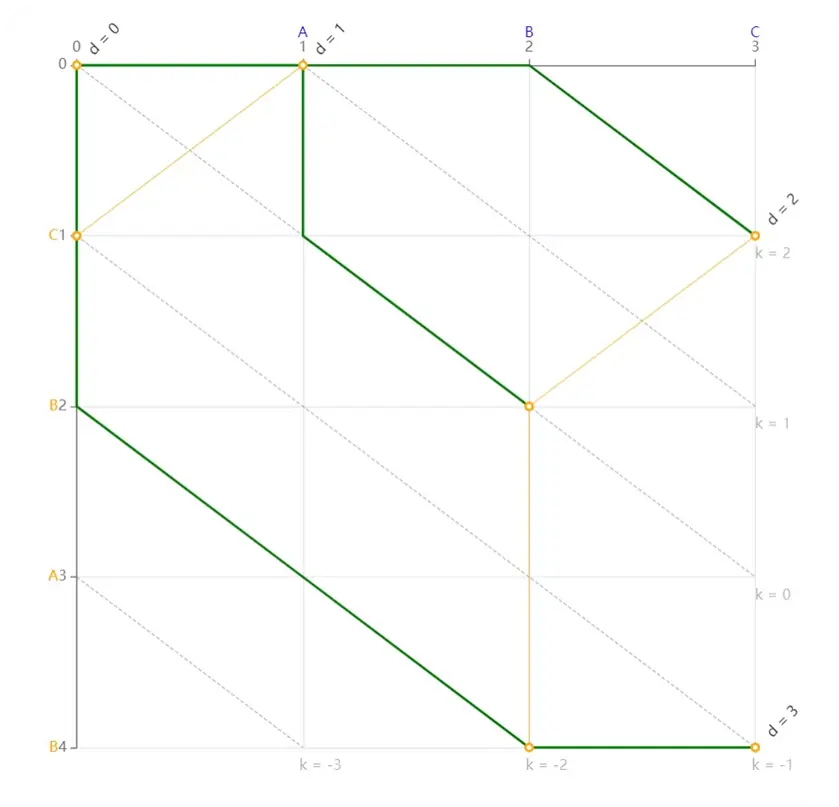

# 代码评审

## 1、执行流程

​	启动Jar包  ->  加载配置（未设置则使用默认配置/动态从git中获取） -> 提取代码变更  ->  调用ChatGLM生成AI评审报告  ->  提交报告到GitHub仓库 → 获取微信access_token → 推送微信通知 → 流程完成

​	**获取代码变更怎么实现：**通过脚本配置，

```
steps:
  - name: Checkout repository
    uses: actions/checkout@v2
    with:
      fetch-depth: 2
```

通过配置 fetch-depth： 2 获取最近的两次提交，然后调用了SDK的内部类， 在Actions容器的本地代码仓库中调用标准的Git命令工具，执行如下命令

```
git diff HEAD ~ 1 HEAD 
```

执行后git返回提交的新增文件、删除文件和修改的文件


## 2、GitCommand

### 1、获取最新提交的哈希

​	在Git中每一次提交都是由哈希值标注的，而非自增ID，他根据文件内容、作者、时间、父提交等信息计算哈希值，所以commit之间是链式结构，Git中主要存blob（文件内容）、tree（目录结构）、commit（提交内容）

​	为什么要设计成哈希结构？

​		保证提交的唯一性，内容不同哈希值就不同；

​		防止篡改，因为每一个commit都存储着前一次提交，假设现在的链是这样的 **A  <--  B  <--  C <--  D**，假设有人修改了B中的内容，那么C、D为了适应必须也修改他们之中的内容

​		去重，相同内容不再重复占用空间

### 2、对比本次与上一次提交区别

```java
// 第二步：获取该 commit 的 diff（与父 commit 对比）
        ProcessBuilder diffProcessBuilder = new ProcessBuilder("git", "diff", latestCommitHash + "^", latestCommitHash);
        diffProcessBuilder.directory(new File("."));
        Process diffProcess = diffProcessBuilder.start();

        StringBuilder diffCode = new StringBuilder();
        BufferedReader diffReader = new BufferedReader(new InputStreamReader(diffProcess.getInputStream()));
        String line;
        while ((line = diffReader.readLine()) != null) {
            diffCode.append(line).append("\n");
        }
        diffReader.close();
```

在拿到两次提交的Hash值之后Git通过Myers算法检查Diff

**Myers算法：**本质就是查找两个字符串之间的差异	核心原理是求解序列之间的编辑距离，向右移动是删除A中的字符，向下移动代表增加B的字符，向右下代表不进行操作

​	